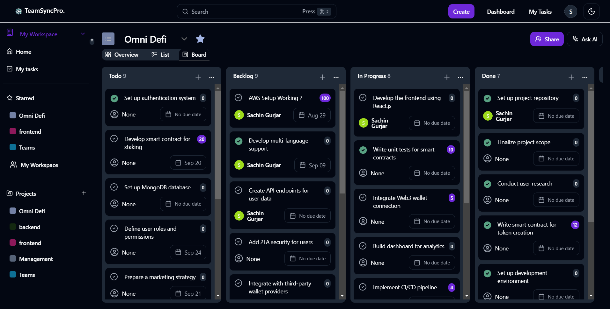
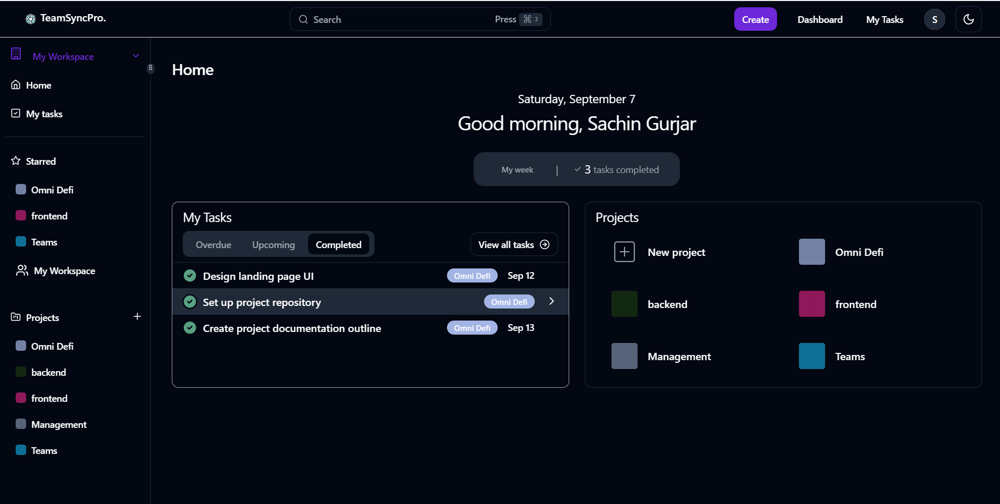
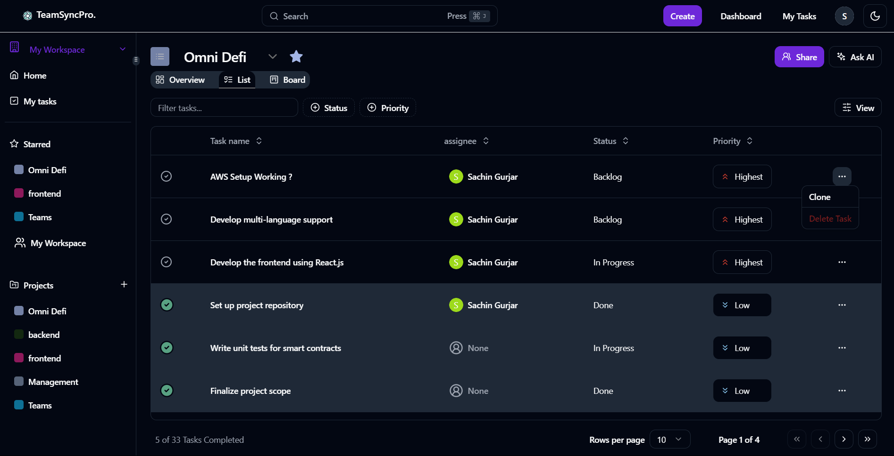
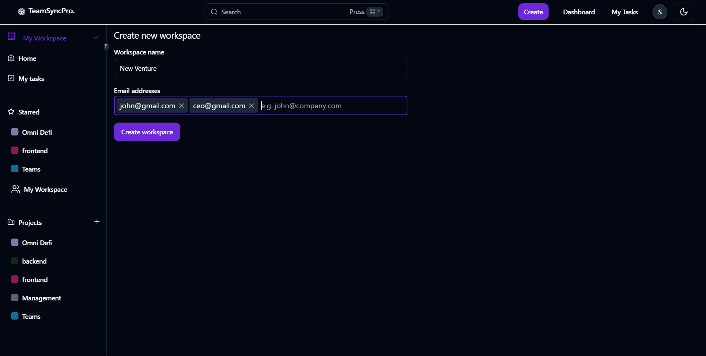
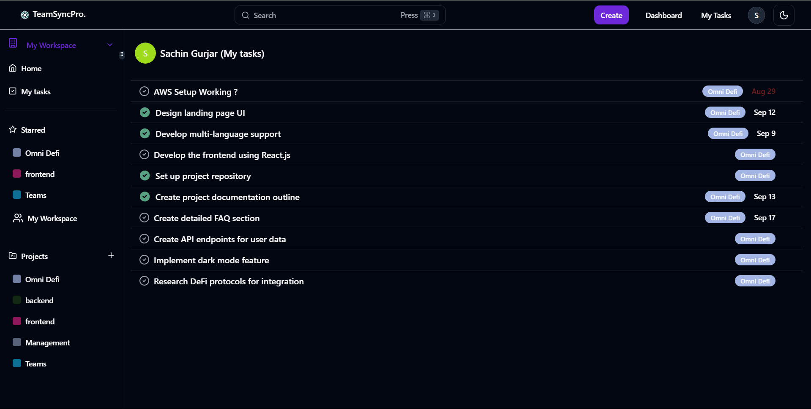
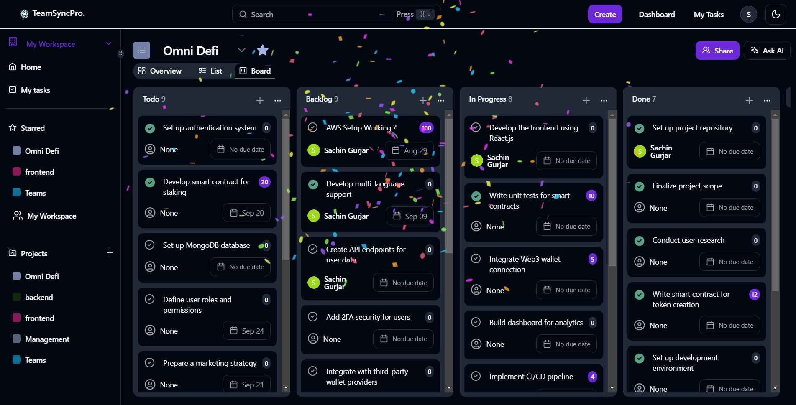
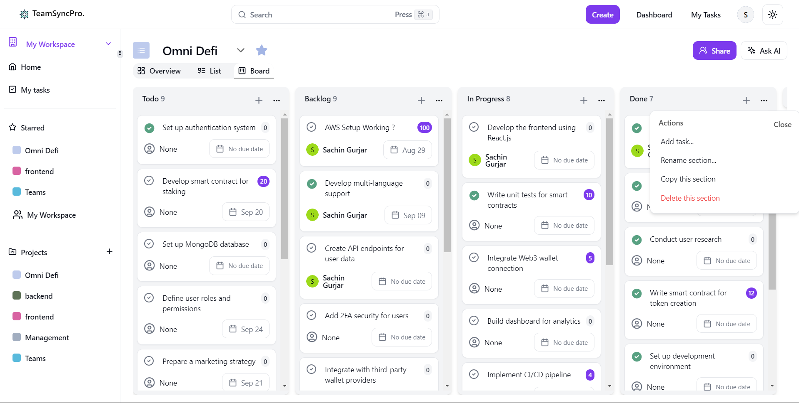
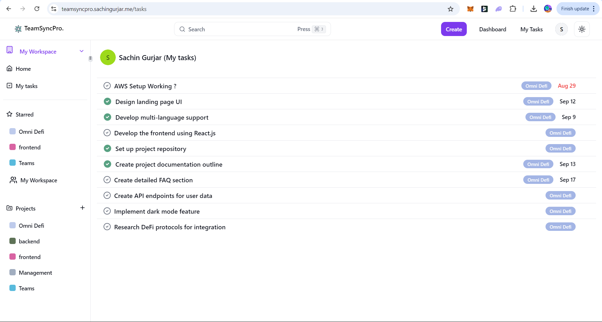

# TeamSyncPro

**TeamSyncPro** is an all-in-one project management tool designed to help teams of all sizes stay organized, collaborate efficiently, and hit deadlines with ease. Whether you’re a solo entrepreneur or part of a large company, TeamSyncPro offers a seamless project management experience that scales to your needs.

## 🚀 Live Demo

Explore **TeamSyncPro** in action:  
🔗 [Live Application](https://teamsyncpro.sachingurjar.me)

API Documentation:  
📄 [Postman API Docs](https://documenter.getpostman.com/view/26033696/2sA3dyiWb2)

Backend Service:  
🌐 [Backend API](https://backend-teamsyncpro.sachingurjar.me)

## ✨ Key Features

- **Custom Workspaces**: Organize your tasks and projects into separate workspaces for better clarity and focus.
- **Invite teams**: Effortlessly invite team members to collaborate on projects.
- **Task Management**: Create tasks, assign them to team members, set deadlines, and track progress with an intuitive interface.
- **Dark Mode and Light Mode**: Enjoy a visually pleasing interface with the option to switch between dark and light themes.
- **Real-Time Collaboration**: Work together with your team in real time, ensuring everyone is on the same page at all times.
- **Milestones and Progress Tracking**: Keep track of your project's progress with visual milestones and completion bars.
- **Notifications and Alerts**: Stay updated with timely notifications about task assignments and deadlines.

## 🛠️ Tech Stack

TeamSyncPro is built using modern technologies to ensure a robust and scalable platform:

### Frontend:
- **Next.js**: Server-side rendering and static site generation.
- **React**: A flexible and component-based UI.
- **Tailwind CSS**: A utility-first CSS framework for responsive design.

### Backend:
- **Node.js** with **Express.js**: High-performance backend with RESTful APIs.
- **MongoDB**: NoSQL database for flexible data modeling.
- **Redis**: In-memory data structure store for caching and rate-limiting.

### Deployment:
- **Docker**: Containerized for consistency across different environments.
- **AWS EC2**: Deployed on a highly scalable cloud infrastructure.

### Authentication & Security:
- **Passport.js**: User authentication with JWT (JSON Web Tokens).
- **Helmet**: Secure HTTP headers to protect the app from vulnerabilities.
- **Express-Rate-Limit**: Prevent brute force attacks by limiting repetitive requests.

## 🎨 Example Screenshots

Get a glimpse of what TeamSyncPro looks like in action:

### Dark Mode

#### Task Board View (With drag and drop)


#### Task Board View


#### Task List View


#### Create Workspace


#### My Tasks View


#### Confetti Celebration


### Light Mode

#### Task Board with Options


#### My Tasks Light Mode


## ⚡ How to Run the Project Locally

To run **TeamSyncPro** locally, follow these steps:

### Prerequisites:
- Node.js
- Redis

### Step 1: Clone the Repository

```bash
git clone https://github.com/sachincoder1/teamsyncpro.git
```

### Step 2: Set Up Environment Variables
You need to create a .env file in both the client and backend directories with the following environment variables:

#### Client Directory (client/.env):
```bash
NEXTAUTH_SECRET=example
NEXTAUTH_URL=http://localhost:3000
BACKEND_URL=http://localhost:8000/api/v1

NEXT_PUBLIC_GUEST_LOGIN_EMAIL=guest@example.com
NEXT_PUBLIC_GUEST_LOGIN_PASSWORD=password
```


#### Backend Directory (backend/.env):
```bash
MONGO_URI=mongodb+srv://<username>:<password>@cluster0.mongodb.net/myDatabase
PORT=8000
NODE_ENV=development
JWT_SECRET=your_jwt_secret
JWT_REFRESH_SECRET=your_jwt_refresh_secret
```


Make sure to replace <username>, <password>, and other placeholders with actual values.

### Step 3: Install Dependencies
Navigate to the client and backend directories, and install the required dependencies:

For the Client:
```bash
cd client
npm install
```

For the Backend:
```bash
cd backend
npm install
```

### Step 4: Redis Setup
Ensure that [Redis](https://redis.io/) is installed on your local machine. If you don't have Redis installed, you can follow the official [installation guide](https://redis.io/docs/latest/operate/oss_and_stack/install/install-redis/) on the Redis website.

Once Redis is installed, start the Redis server by running (for ubuntu/wsl):
```bash
sudo service redis-server start
```

Once Redis is running, you can test it by running redis-cli:
```bash
redis-cli
```


### Step 5: Run the Application
Running the Client:
For development mode:
```bash
npm run dev
```

For production build:

```bash
npm run build
npm start
```


Running the Backend:
For development mode:

```bash
npm run dev
```

For production build:

```bash
npm run build
npm start
```


### Step 6: Docker Setup
To simplify the setup, you can also use Docker to run the entire application (both frontend and backend) in containers.

First, ensure that you have Docker installed on your system.
Navigate to the root of the repository where the docker-compose.yml file is located.
Run the following command:
```bash
docker-compose up --build
```


This will automatically build and start the frontend and backend services, along with the MongoDB and Redis services.

### Step 7: Access the Application
Client (Frontend): http://localhost:3000
Backend API: http://localhost:8000/api/v1
You should now be able to access TeamSyncPro locally!


